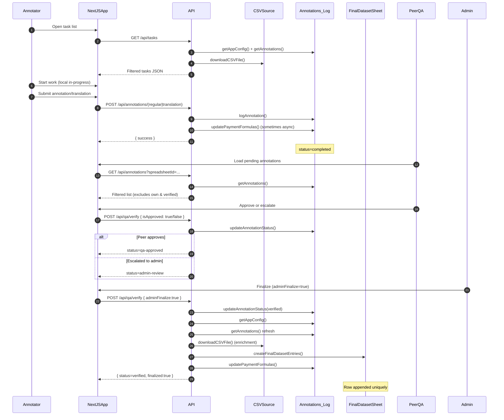
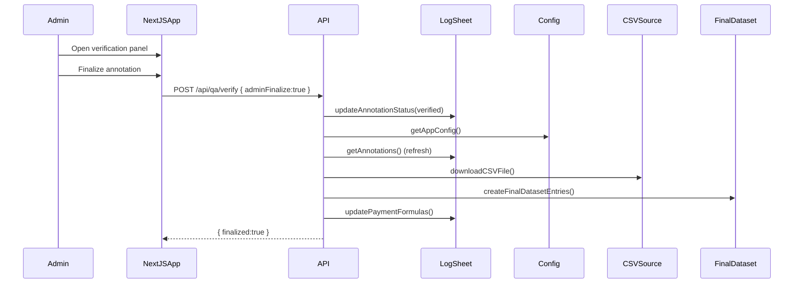

# Annotation → Translation → QA → Final Dataset Flow

This document contains Mermaid sequence diagrams describing the lifecycle of an item in the AfriBERTa-NG FND data annotation platform.

## 1. High-Level Lifecycle


## 2. Translation Path Focus
```mermaid
sequenceDiagram
    participant Translator
    participant NextJSApp
    participant API
    participant Sheets as Annotations_Log

    Translator->>NextJSApp: Select EN source row
    NextJSApp->>API: POST /api/annotations/translation { rowId, translationLanguage }
    API->>Sheets: logAnnotation(assign translator_*_id)
    API-->>NextJSApp: success
    Note over Sheets: status=completed; language columns updated
```

## 3. Admin Finalization Path


## 4. Status Transition Reference
| From | Trigger | Actor | Endpoint | To | Notes |
|------|---------|-------|----------|----|-------|
| not-started | User begins work | Annotator | (client only) | in-progress | Local state only |
| in-progress | Submit annotation | Annotator | POST /api/annotations/* | completed | Logged to sheet |
| completed | Peer approves | PeerQA | POST /api/qa/verify | qa-approved | Sets verifiedBy (QA) |
| completed | Peer escalates | PeerQA | POST /api/qa/verify | admin-review | QA comments retained |
| qa-approved | Admin finalizes | Admin | POST /api/qa/verify { adminFinalize:true } | verified | Final dataset append |
| admin-review | Admin finalizes | Admin | POST /api/qa/verify { adminFinalize:true } | verified | Handles escalation |
| any pre-final | Admin rejects | Admin | (admin verify route) | invalid | Hidden from list |
| any pre-final | Admin requests changes | Admin | (admin verify route) | needs-revision | Only original annotator sees |
| needs-revision | Annotator resubmits | Annotator | POST /api/annotations/* | completed | Re-enters QA cycle |

## 5. Maintenance Notes
- Update diagrams when adding new statuses or altering verification logic.
- Ensure filtering in `/api/tasks` aligns with hidden statuses (invalid, admin-review, needs-revision not owned, verified).
- Final dataset insertion only occurs on transition to `verified` with uniqueness guard.

## 6. Related Source Files
- `app/api/tasks/route.ts`
- `app/api/annotations/*`
- `app/api/qa/verify/route.ts`
- `app/api/admin/verify/route.ts`
- `lib/google-apis.ts`
- `lib/annotation-mapper.ts`
- `lib/data-store.ts`

---
Generated on: 2025-09-16
